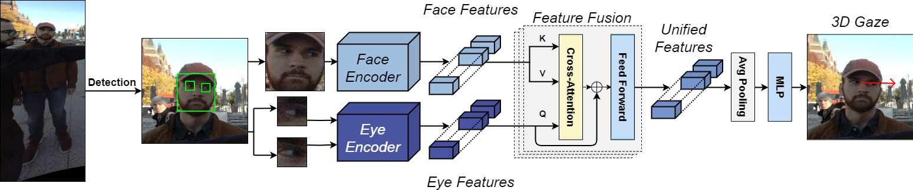
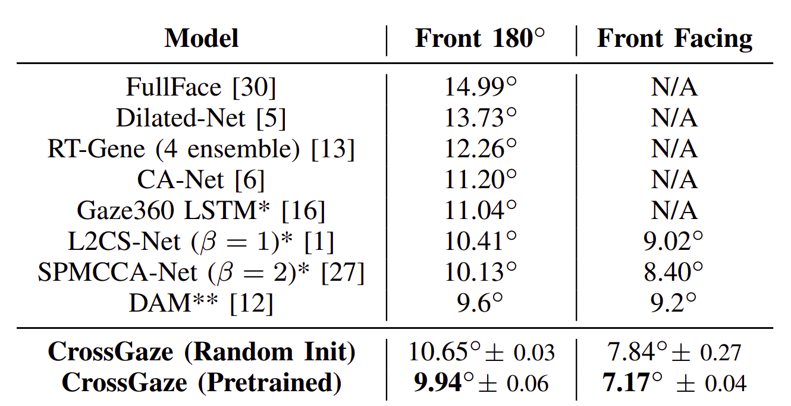

<h1 align="center"><span style="font-weight:normal">CrossGaze: A Strong Method for 3D Gaze Estimation in the Wild</h1>
<h3 align="center"><span style="font-weight:normal">Accepted at: The 18th IEEE International Conference on Automatic Face and Gesture Recognition </h3>

<p align="center"> <a href="https://arxiv.org/abs/2402.08316"> 📘 Paper PDF </a> | <a href=""> 🪧 Poster </a> | <a href="https://docs.google.com/presentation/d/1M4sC_W6577ayZF8TvGi1IZhuFo4Ng38MKY1P8AIYzlg/edit?usp=sharing"></p>

<div align="center">
<strong> Authors </strong>: <a href="https://scholar.google.com/citations?user=ct7ju7EAAAAJ&hl=en&oi=ao"> Andy Catruna </a>, <a href="https://scholar.google.com/citations?user=cdYk_RUAAAAJ&hl=en"> Adrian Cosma</a>, <a href="https://scholar.google.com/citations?user=yjtWIf8AAAAJ&hl=en">Emilian Radoi </a>
</div>

<div></div>



## <a name="abstract"></a> 📘 Abstract
*Gaze estimation, the task of predicting where an individual is looking, is a critical task with direct applications in areas such as human-computer interaction and virtual reality. Estimating the direction of looking in unconstrained environments is difficult, due to the many factors that can obscure the face and eye regions. In this work we propose CrossGaze, a strong baseline for gaze estimation, that leverages recent developments in computer vision architectures and attention-based modules. Unlike previous approaches, our method does not require a specialized architecture, utilizing already established models that we integrate in our architecture and adapt for the task of 3D gaze estimation. This approach allows for seamless updates to the architecture as any module can be replaced with more powerful feature extractors. On the Gaze360 benchmark, our model surpasses several state-of-the-art methods, achieving a mean angular error of 9.94◦ . Our proposed model serves as a strong foundation for future research and development in gaze estimation, paving the way for practical and accurate gaze prediction in real-world scenarios.*

## <a name="getting-started"></a> 📖 Getting Started

### Requirements
Install all dependencies with the following command:
```pip install -r requirements.txt```

### Data
* Download the **Gaze360 dataset** from [here](http://gaze360.csail.mit.edu/download.php).

* Apply data preprocessing from [here](http://phi-ai.buaa.edu.cn/Gazehub/3D-dataset/).

* Store the dataset to ```datasets/Gaze360```.

### Experiments from the paper

**Backbone comparison**

Run ```scripts/train_backbone_models.sh```

**Pretraining datasets comparison**

Run ```scripts/train_dataset_models.sh```

**Fusion methods comparison**

Run ```scripts/train_fusion_models.sh```

## <a name="results"></a> 📖 Results

<div>

</div>

## <a name="citation"></a> 📖 Citation
If you found our work useful or use our dataset in any way, please cite our paper:

```
@inproceedings{catruna2024crossgaze,
  title={CrossGaze: A Strong Method for 3D Gaze Estimation in the Wild},
  author={Catruna, Andy and Cosma, Adrian and Radoi, Emilian},
  booktitle={The 18th IEEE International Conference on Automatic Face and Gesture Recognition},
  year={2024}
}
```

## <a name="license"></a> 📝 License

This work is protected by [CC BY-NC-ND 4.0 License (Non-Commercial & No Derivatives)](LICENSE).
